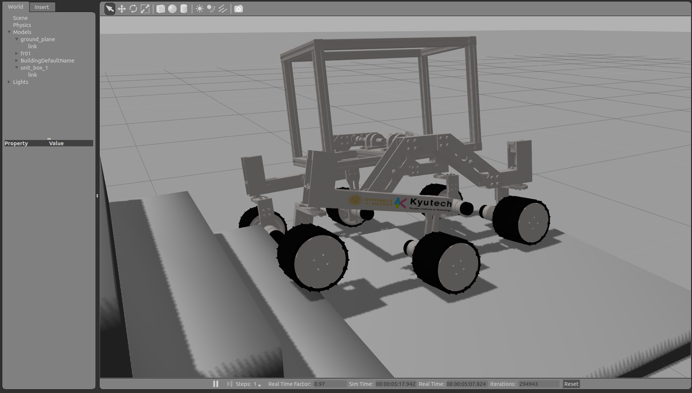

# Welcome to the forest_robot_project ! 

### About
This is the repository for the forest robot (named FR01).  
**FR01** is created by [Nishida-Lab](http://lab.cntl.kyutech.ac.jp/~nishida/index.html) and [Ivan-Lab](https://www.ingegneria.unisalento.it/scheda_docente/-/people/ivan.giannoccaro).  
It has rocker-bogie mecanism. Basecally, We use [ROS](http://www.ros.org/) for control and integration.

### Install
See [Install wiki](https://github.com/Nishida-Lab/forest_robot_project/wiki/Installation-%5BEnglish%5D).

### Usage
See [Usage wiki](https://github.com/Nishida-Lab/forest_robot_project/wiki/Usage-%5BEnglish%5D).
